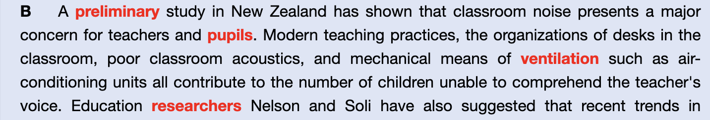
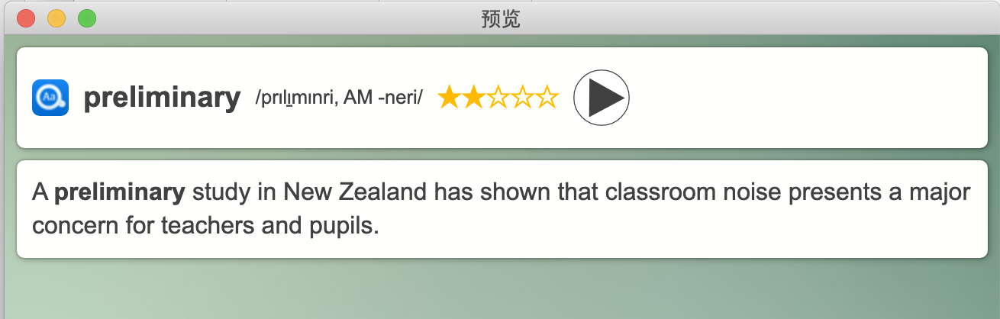
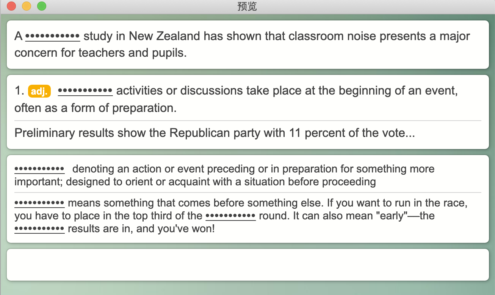
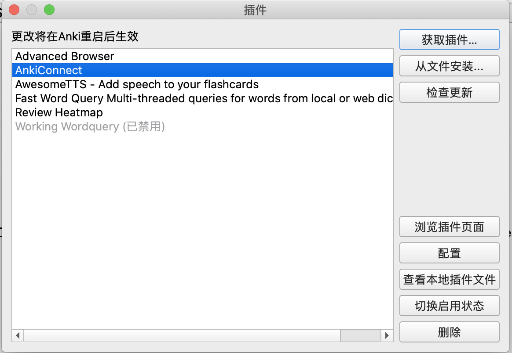
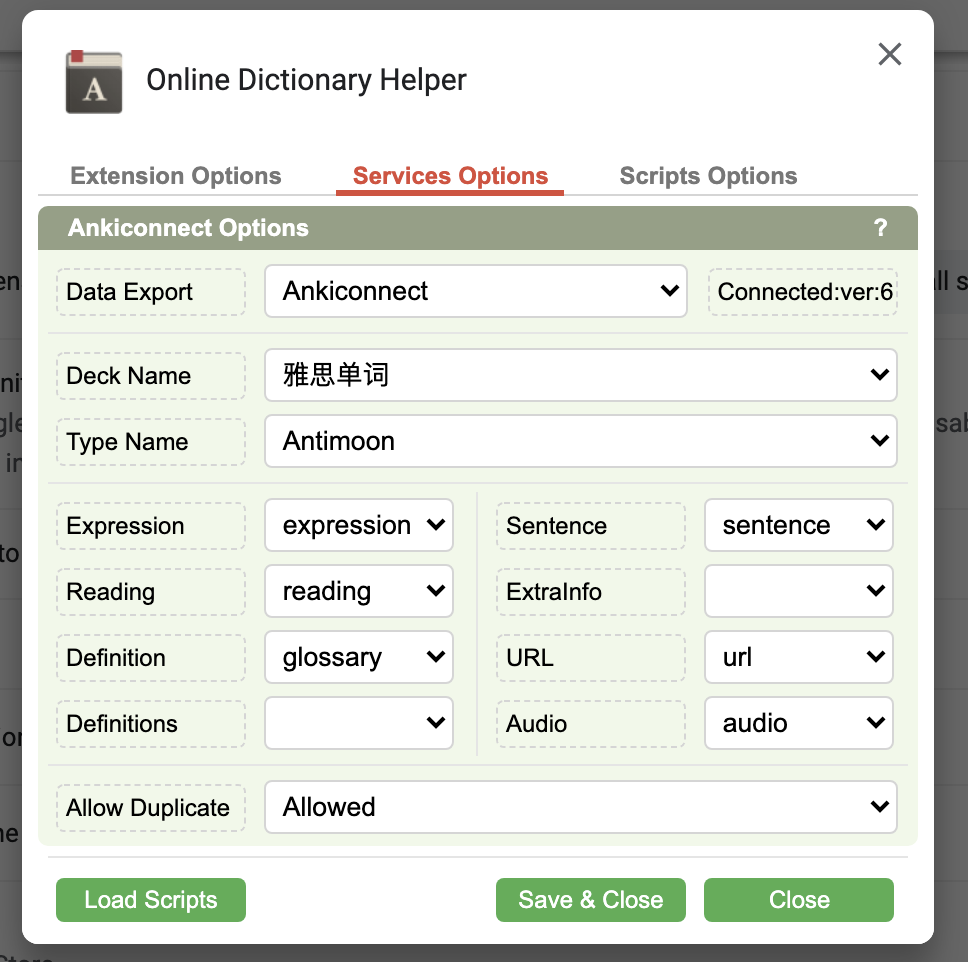
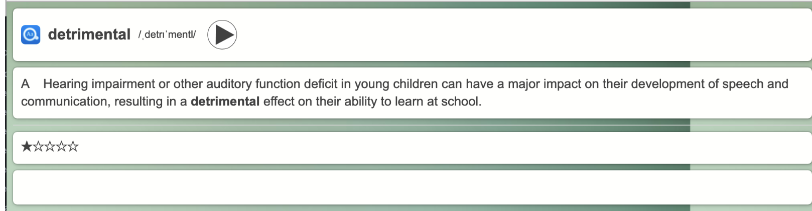
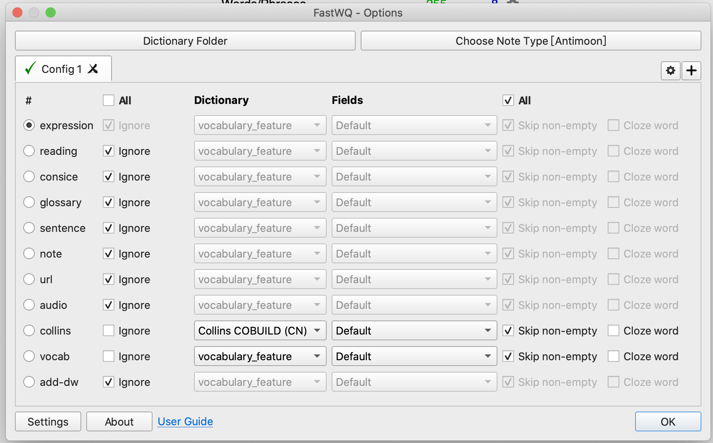

## 参考资料 aka. 前期准备

1. [我的 Anki 制卡方法 - 在各种场景下使用划词助手](https://plume.pullopen.xyz/~/Study/%E6%88%91%E7%9A%84Anki%E5%88%B6%E5%8D%A1%E6%96%B9%E6%B3%95)

   按照里面的步骤安装 online dictionary helper(以下简称 ODH)

2. [Antimoon 划词助手兼容模板](https://www.laohuang.net/20180108/antimoon-template-3/)

   需下载里面的 Ankimoon 模版 4.0 版本，下载后用 anki 打开是个牌组，删除牌组，会多一个模版

   还需下载里面的 collins 和 vocab mdx 文件，当然也可以用自己喜欢的其他词典 mdx 文件

3. [背单词软件 Anki 之强力插件 WordQuery 的使用方法介绍](https://www.bilibili.com/video/BV1qW411a7fZ)

   [背单词软件 Anki 之 Antimoon 特色模板教程(definition-word 卡片自动生成)](https://www.bilibili.com/video/BV1zW411a7Dz)

   ODH 作者老黄对 word query 和 ankimoon 的讲解

4. [Making SRS items (cards) for learning languages](https://www.antimoon.com/how/usingsm-makeitems.htm)

   关于为什么要看释义猜单词

## 效果

最终要实现的效果是：网页上遇到生词通过 ODH 自动添加到 Anki，此时卡片里只有网络词典的释义，然后可选择通过 word query 向已添加的卡片增加本地词典的释义，并使卡片成为双向卡片，即一个普通 word-definition 卡片和一个反向的 definition-word 卡片，反向卡片给你单词释义让你填单词。

原文

word-definition 卡片，正面是单词和你遇到的句子/上下文，背面是释义

definition-word 卡片，正面是你遇到的句子和扣掉单词的释义，背面是单词

## 步骤

1. 先将需用到的插件安装好，中间 3 个是必需的。

   

2. 从资料 2 中下载 ankimoon 4.0 模版，双击用 anki 打开，删除名为 ankimoon 的牌组，模版就添加成功了，在“工具-管理笔记模版”里可找到。
3. 在谷歌商店里搜索插件 online dictionary helper 并安装，安装后设置如图

   

   其他的地方请参考资料 1。这里的 definition 到 anki 卡片里背单词时是只显示中文的，如果浏览卡片则会看到完整的柯林斯释义。后面还会用 word query 从本地柯林斯词典获取解释，背单词的页面会显示本地词典释义。

   设置好后，就可以把网页里遇到的生词添加到 anki 了，需注意这时背面会显示为空白，因为作者设置了默认不显示 glossary 的内容，点击一下空白卡片就会出现单词释义。

   

   最底下的空白卡片需手动点击（那个星星是我一开始设置错了，不用在意）

4. 设置 fast word query 插件

   点击“工具-FastWQ”进入设置页面，选择词典所在文件夹和 Antimoon 模版，将 collins 和 vocab 两个字段分别与两个词典对应

   

5. 设置好后点“浏览”，选中需要添加 collins 和 vocab 字段的卡片，在最上方的工具栏点击”FastWQ-Query Selected”就会自动将词典内容添加到卡片里，如果是一词多义可以将多余的内容删除，只保留当前用到的意思。

   有些单词释义太多了，如果觉得手动删除麻烦，可以直接在划词助手里设置 definition 对应 collins, 这样只会添加一个释义，用 word query 只会填 vocab 字段。但这样的缺点是背单词的时候没办法把中文意思隐去。

6. 向卡片的 add-dw 字段填入任何字符就可使卡片成为双向卡片，即多了一张 definition-word 卡片。

## 改造模版

以上都设置好后就可以使用啦，如果有用着不顺手的地方可以改造一下 antimoon 模版。怕自己改坏了就先复制之后再改。

比如在“工具-管理笔记模版”里选中模版后点击“字段-重命名”可以改变字段名字，如果英语名容易混淆，就可以改成对应中文：reading-音标，audio-发音，sentence-原句，glossary-中文释义；

我还增加了“要记的意思”（放柯林斯和 vocab 以外的词典释义，查词典时真正让我理解这是什么意思的一段解释）、“词典例句”这两个字段。

如果你会点 CSS 和 JavaScript，在“工具-管理笔记模版-卡片”里可以看到模版的源码，可以对它更多改造

这是我[改造后的 anki 模版](https://drive.google.com/file/d/1DmvE-AiS4BC1UcuSk2HrpqEns76ZwnOu/view?usp=sharing)，其实会有 bug，仅供参考，我目前主要用这个

另外，划词插件会经常连不上，需要不断重新打开插件设置，所以我现在基本上都是在 anki 里面直接添加，用 word query 很方便。只是需要复制一下原句。
